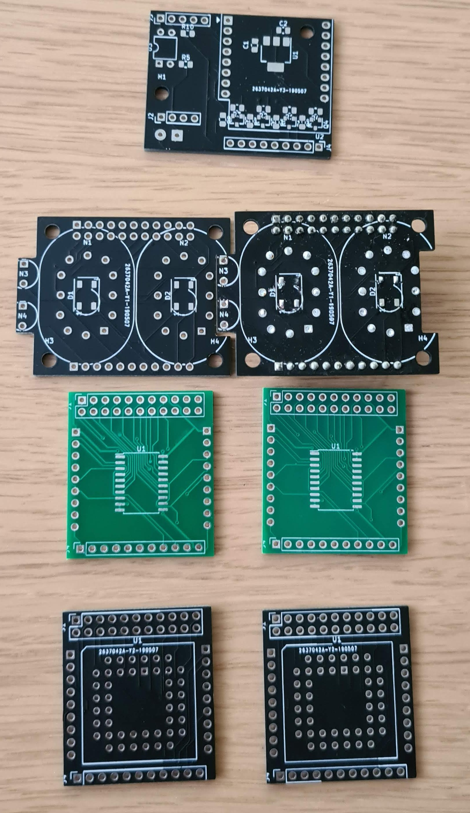

# PCBs for nixie modules

These are the PCBs for the modular nixie display I designed, *but note that they
have many problems*. I'm a firmware engineer and I hate working on PCBs, and
even though these have many problems (and I autorouted most of them, which seems
sacrilege in hw design), it reached the point where it is good enough for me.

Pull requests are welcome.

## The Nixie board

The Nixie board is designed around IN-12B nixies with INS-1 neon bulbs as colon.
When the colon is not populated, the pads of it can be hidden in the preceding
board. Therefor, the board can be used both as clock displays with a colon and
numerical displays.

It will likely work with thin legged standing style tubes too (like the GDR,
like Z570M).

This board also has 4 M3 mounting holes, in each corner (on a 36.5x29mm
rectangle)

The anode resistors should be tuned for the tubes and anode voltage, here's what
I used for IN-12B / INS-1 at 170V power supply:

- R1/R3: 12kOhm (main anode resistor)
- R2/R4: 91kOhm (additional resistor on the decimal point's cathode)
- R5/R6: 240kOhm (INS-1 anode resistor)

### Known issues

- The board includes a WS2812B ("neopixel") backlight for each tube but that
  never worked. However, I never really wanted to use it, just thought about
  maybe if it looks good, so I won't fix it.
- When used with TPIC6592 drivers, INS-1 needs an extra ~50V zener in series to
  allow it turn off. Since it is not socketed, it can be easily added.

## The Driver boards

The driver board fits under the nixie board and provides power/control to it. I
have two versions of it:

- Based on HV5122 (in socket)
- Based on TPIC6592 (smd)

I highliy recommend the one based on TPIC6592, as HV5122 does not have a true
latch (only output enable) and way more expensive.

Both design has footprint for filter caps, but I never used it on the TPIC
design.

The module connecting pin headers are ~15mm from each other when the nixie board
is used without colon, but I ended up using wires on one side and 90 degree pin
headers on the other. The excess wire can be tugged away between the boards.

### Known issues

- The 15mm distance was designed for pin headers measured for 14mm distance, but
  what I got in the end was much closer
- The HV5122 board is not very well tested. It was an earlier iteration of the
  design, but with a few hw errors, I managed to blew my chips, and I don't
  intend to order new ones.

## The Control board

**The control board has the most issues, and I strongly recommend against
manufacturing it before fixing it. However, I did fix it with ugly hacks, so I
won't bother paying for another run. I put it here for archiving only.**

The control board is designed around a Wemos D1 mini (or clone) and a
cheap/small 170V power supply, both readily available from aliexpress and
similar sites. It also has a pin header for I2C, where I have a bh1750fvi light
sensor panel connected for dimming.

### Known issues

- I missed routing the 12V input to anything - fixable with a jumper wire
- AMS1117 was a bad decision for running the Wemos, and every other 5V device. I
  currently have a 3 pin DCDC board wired to its pads
- I used an optogate for dimming (via PWM) the high voltage. My driver board has
  a shutdown pin that would have probably work just as good
- The level shifters are configured for 12V (HV5122), and needs cutting a
  trace/adding a jumper wire to set it for 5V, needed for the TPIC drivers
- The power input needs bigger holes on the PCB to be able to use with proper
  wire gauge.
